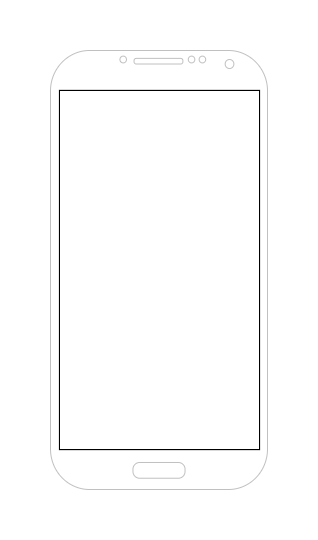
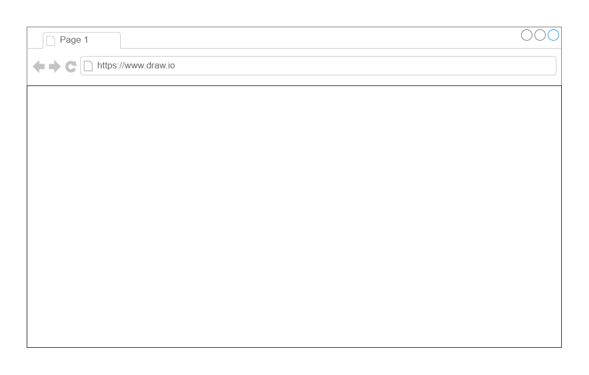

<h1 align="center">
    <a href="#" alt="My Template Repository">My Template Repository</a>
</h1>

<h3 align="center">
    My template repository for projects
</h3>

<p align="center">
    <a href="https://github.com/efernandes-tech/proj-007-my-template-repository/commits/main">
        
    </a>
    
    <a href="https://edersonfernandes.com.br">
        
    </a>
</p>

<h4 align="center">
    Status: In progress | Finished
</h4>

<p align="center">
    <a href="#about">About</a> •
    <a href="#features">Features</a> •
    <a href="#layout">Layout</a> •
    <a href="#how-it-works">How it works</a> •
    <a href="#tech-stack">Tech Stack</a> •
    <a href="#author">Author</a>
</p>

## About

My Template Repository - description about the project

---

## Features

-   [x] Feature One:

    -   [x] description of task
    -   [x] description of task
    -   [x] description of task
    -   [x] description of task:
        -   topic 1
        -   topic 2
        -   topic 3

-   [ ] Feature Two:

    -   [x] description of task
    -   [ ] description of task
    -   [ ] description of task

---

## Layout

The application layout is available on Draw.io:

<a href="https://app.diagrams.net">
  
</a>

### Mobile

<p align="center">
  
</p>

### Web

<p align="center" style="display: flex; align-items: flex-start; justify-content: center;">
  
</p>

---

## How it works

This project is divided into three parts:

1. Backend folder (src { API { Controller, Infra } , Worker , Migration }, test { Unit , Integration } )
2. Frontend folder (src, public, tests)
3. Mobile folder (src, tests)

Both Frontend and Mobile need the Backend to be running to work.

### Pre-requisites

Before you begin, you will need to have the following tools installed on your machine:
[Git](https://git-scm.com), [Node.js](https://nodejs.org/en/), [.NET SDK](https://dotnet.microsoft.com/en-us/download).

In addition, it is good to have an editor to work with the code like [VSCode](https://code.visualstudio.com/)

#### Running the Backend (Server)

```bash

# Clone this repository
git clone git@github.com:efernandes-tech/proj-007-my-template-repository.git

# Access the project folder cmd/terminal
cd backend/src/MyTemplateRepository.API

# install the dependencies
dotnet build

# Run the application in development mode
dotnet run

# The server will start at port: 5000 - go to http://localhost:5000

```

<p align="center">
    <a href="https://github.com/efernandes-tech/proj-007-my-template-repository/blob/main/support/MyTemplateRepository.postman_collection.json" target="_blank">
        
    </a>
</p>

#### Running the Frontend (Web)

```bash

# Clone this repository
git clone git@github.com:efernandes-tech/proj-007-my-template-repository.git

# Access the project folder in your terminal
cd frontend

# Install the dependencies
yarn install

# Run the application in development mode
yarn start

# The application will open on the port: 3000 - go to http://localhost:3000

```

---

## Tech Stack

The following tools were used in the construction of the project:

#### **Web** ([React](https://reactjs.org/) + [TypeScript](https://www.typescriptlang.org/))

-   **[Create React App](https://create-react-app.dev/)**
-   **[React Router Dom](https://reactrouter.com/en/main/start/tutorial/)**
-   **[Chakra UI](https://chakra-ui.com/getting-started)**
-   **[React Icons - Heroicons 2](https://react-icons.github.io/react-icons/icons?name=hi2)**
-   **[ESLint](https://eslint.org/docs/latest/use/getting-started)** (dev)
-   **[Prettier](https://prettier.io/docs/en/)** (dev/with eslint)

> See the file [package.json](https://github.com/efernandes-tech/proj-007-my-template-repository/blob/main/frontend/web/package.json)

#### **Server** ([.NET](https://dotnet.microsoft.com/en-us/download) + [C#](https://learn.microsoft.com/en-us/dotnet/csharp/tour-of-csharp/))

-   **[ASP.NET](https://learn.microsoft.com/en-us/aspnet/core/)**
-   **[SQLite](https://github.com/mapbox/node-sqlite3)**
-   **[DocFX](https://dotnet.github.io/docfx/index.html)**
-   **[reportgenerator](https://reportgenerator.io/usage)**

> See the file [api.csproj](https://github.com/efernandes-tech/proj-007-my-template-repository/blob/main/backend/src/api.csproj)

#### **Mobile** ([React Native](http://www.reactnative.com/) + [TypeScript](https://www.typescriptlang.org/))

-   **[React Native Elements](https://reactnativeelements.com/)**
-   **[React Navigation](https://reactnavigation.org/)**
-   **[React Native Save Area](https://appandflow.github.io/react-native-safe-area-context/)**
-   **[React Native Vector Icons](https://oblador.github.io/react-native-vector-icons/)**
-   **[React Native Device Info](https://github.com/react-native-device-info/react-native-device-info)**
-   **[Axios](https://github.com/axios/axios)**
-   **[Expo](https://expo.io/)**

> See the file [package.json](https://github.com/efernandes-tech/proj-007-my-template-repository/blob/main/mobile/package.json)

#### **Utilities**

-   Prototype: **[Draw.io](https://app.diagrams.net/)** → **[MyTemplateRepository](https://app.diagrams.net)**
-   Editor: **[Visual Studio Code](https://code.visualstudio.com/)** → Extensions: **[ESLint](https://marketplace.visualstudio.com/items?itemName=dbaeumer.vscode-eslint)**, **[EditorConfig](https://marketplace.visualstudio.com/items?itemName=EditorConfig.EditorConfig)**
-   Dependency: **[Yarn](https://classic.yarnpkg.com/en/docs/cli/)** → **[doc package.json](https://docs.npmjs.com/cli/v10/configuring-npm/package-json)**
-   Build: **[esbuild](https://esbuild.github.io/getting-started/)** → Tip: **[Post](https://dev.to/em1dio/pt-br-usando-esbuild-com-typescript-n2k)**

-   API Test: **[Postman](https://www.postman.com/)**
-   Multiple Version Node: **[NVM](https://github.com/coreybutler/nvm-windows)**
-   Commit Conventional: **[Commitlint](https://github.com/conventional-changelog/commitlint)**

-   API: **[IBGE API](https://servicodados.ibge.gov.br/api/docs/localidades?versao=1)** → **[API States](https://servicodados.ibge.gov.br/api/docs/localidades?versao=1#api-UFs-estadosGet)**, **[API Counties](https://servicodados.ibge.gov.br/api/docs/localidades?versao=1#api-Municipios-estadosUFMunicipiosGet)**
-   Markdown: **[StackEdit](https://stackedit.io/)**, **[Markdown Emoji](https://gist.github.com/rxaviers/7360908)**
-   Fonts: **[Ubuntu](https://fonts.google.com/specimen/Ubuntu)**, **[Roboto](https://fonts.google.com/specimen/Roboto)**

---

## Author

<a href="https://github.com/efernandes-tech">
    
    <br />
    <sub><b>Ederson Fernandes</b></sub>
</a>

<br />

[](https://edersonfernandes.com.br)
[](https://www.linkedin.com/in/edersonfernandesdev)
[](mailto:seuemail@dominio.com)
